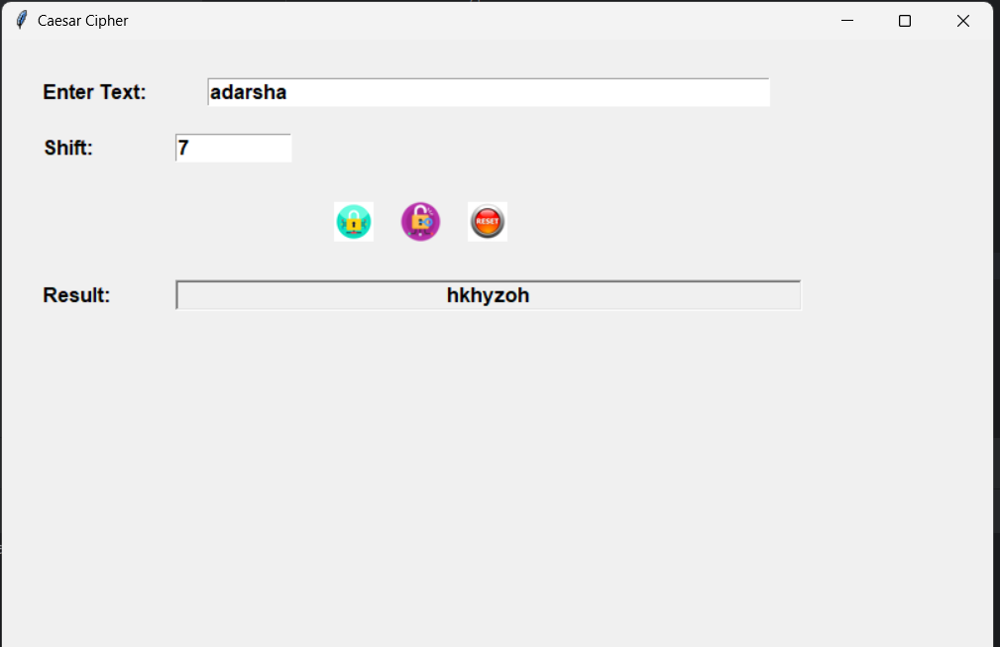
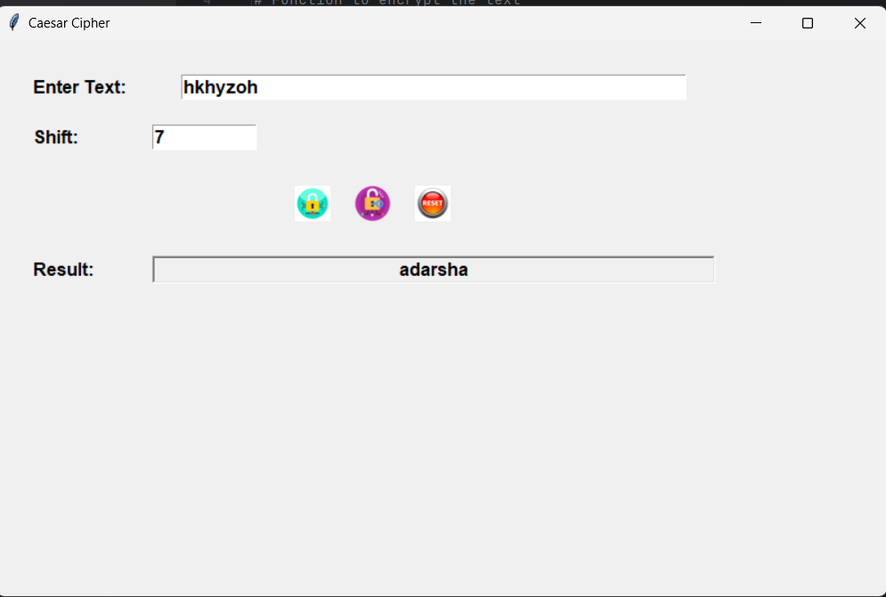
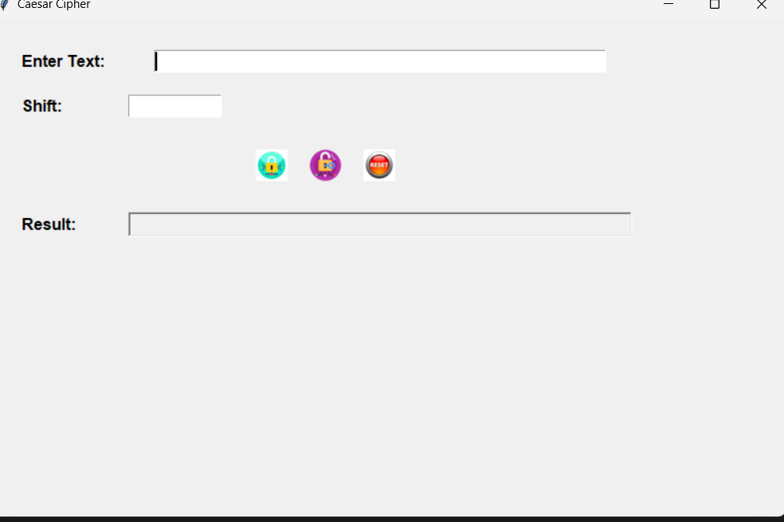

# Caesar Cipher Tkinter Application

This application provides a graphical user interface (GUI) for performing Caesar Cipher encryption and decryption using Python's Tkinter library.

## Features

- **Encryption**: Encrypts text using a Caesar Cipher with a specified shift value.

  

- **Decryption**: Decrypts text using a Caesar Cipher with a specified shift value.

  
  
- **Clear**: Resets the input fields and clears the result display.

  

## Instructions

1. **Prepare Image Files**:
   - Place the following images in the same directory as the script:
     - `encrypt.png` - Image for the Encrypt button
     - `decrypt.png` - Image for the Decrypt button
     - `reset.png` - Image for the Clear button

2. **Run the Application**:
   - Ensure Python 3.x is installed on your system.
   - Execute the script file using Python to start the application:
     ```bash
     python caesar_cipher_gui.py
     ```

3. **Using the Application**:
   - **Enter Text**: Input the text you wish to encrypt or decrypt in the "Enter Text" field.
   - **Shift**: Enter the shift value for the Caesar Cipher in the "Shift" field.
   - **Encrypt**: Click the Encrypt button (with the custom image) to encrypt the text.
   - **Decrypt**: Click the Decrypt button (with the custom image) to decrypt the text.
   - **Clear**: Click the Clear button (with the custom image) to reset the input fields and result.

## Customizing Images

To use your own images for the buttons:

1. **Prepare Your Images**:
   - Make sure your images are in PNG format and appropriately sized (e.g., 100x50 pixels).

2. **Rename and Replace**:
   - Replace the existing images with your custom images:
     - `encrypt.png` for the Encrypt button
     - `decrypt.png` for the Decrypt button
     - `reset.png` for the Clear button

3. **Ensure Image Paths**:
   - Verify that the image files are in the same directory as the script.

## Troubleshooting

- **Error Loading Images**: If images do not load, check that they are in PNG format, correctly named, and located in the same directory as the script. Ensure no file path issues are present.

## License
This project is open-source and available for personal or educational use. Feel free to modify and share it as you like.

## Acknowledgements

- Tkinter documentation and Python community resources.
